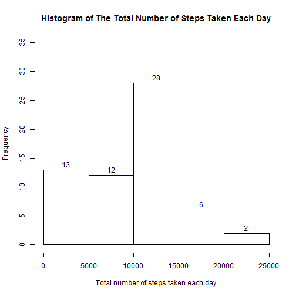
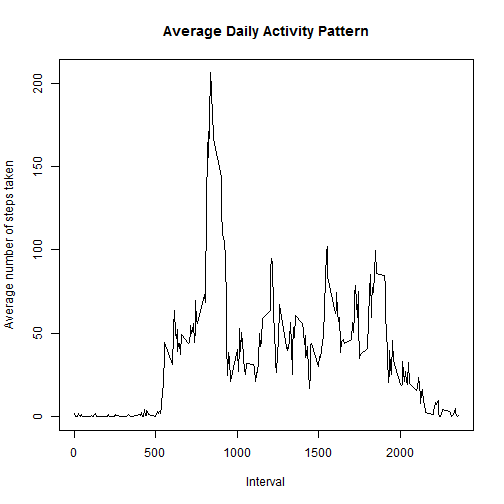
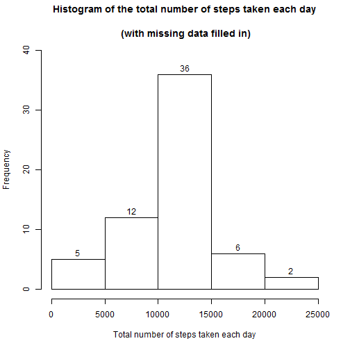
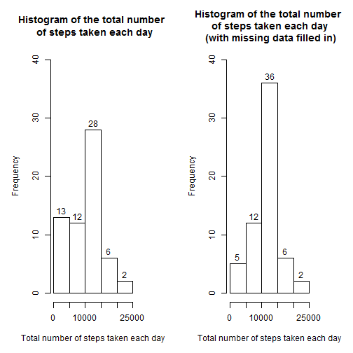

**Loading and preprocessing the data**

data<-read.csv("activity.csv")


**1.What is mean total number of steps taken per day?**

First,calculate the total number of steps taken per day:

```r
data1<-data.frame("steps"=numeric(61),"date"=character(61),stringsAsFactors=FALSE)
for (i in 1:61){
    data1$steps[i]<-sum((data[(288*(i-1)):(288*i),])[,1],na.rm=TRUE)
    data1$date[i]<-(levels(data$date))[[i]]
}
data1
```

```
##    steps       date
## 1      0 2012-10-01
## 2    126 2012-10-02
## 3  11352 2012-10-03
## 4  12116 2012-10-04
## 5  13294 2012-10-05
## 6  15420 2012-10-06
## 7  11015 2012-10-07
## 8      0 2012-10-08
## 9  12811 2012-10-09
## 10  9920 2012-10-10
## 11 10304 2012-10-11
## 12 17382 2012-10-12
## 13 12426 2012-10-13
## 14 15098 2012-10-14
## 15 10139 2012-10-15
## 16 15084 2012-10-16
## 17 13452 2012-10-17
## 18 10085 2012-10-18
## 19 11829 2012-10-19
## 20 10403 2012-10-20
## 21  8821 2012-10-21
## 22 13460 2012-10-22
## 23  8918 2012-10-23
## 24  8355 2012-10-24
## 25  2492 2012-10-25
## 26  6778 2012-10-26
## 27 10119 2012-10-27
## 28 11458 2012-10-28
## 29  5018 2012-10-29
## 30  9819 2012-10-30
## 31 15414 2012-10-31
## 32     0 2012-11-01
## 33 10600 2012-11-02
## 34 10571 2012-11-03
## 35     0 2012-11-04
## 36 10439 2012-11-05
## 37  8334 2012-11-06
## 38 12883 2012-11-07
## 39  3219 2012-11-08
## 40     0 2012-11-09
## 41     0 2012-11-10
## 42 12608 2012-11-11
## 43 10765 2012-11-12
## 44  7336 2012-11-13
## 45     0 2012-11-14
## 46    41 2012-11-15
## 47  5441 2012-11-16
## 48 14339 2012-11-17
## 49 15110 2012-11-18
## 50  8841 2012-11-19
## 51  4472 2012-11-20
## 52 12787 2012-11-21
## 53 20427 2012-11-22
## 54 21194 2012-11-23
## 55 14478 2012-11-24
## 56 11834 2012-11-25
## 57 11162 2012-11-26
## 58 13646 2012-11-27
## 59 10183 2012-11-28
## 60  7047 2012-11-29
## 61     0 2012-11-30
```

Then,make a histogram of the total number of steps taken each day:

```r
hist(data1$steps,main="Histogram of The Total Number of Steps Taken Each Day",
     xlab="Total number of steps taken each day",labels=TRUE,ylim=c(0,35))
```

 

Last,calculate and report the mean and median of the total number of steps taken per day:

```r
summary(data1$steps)
```

```
##    Min. 1st Qu.  Median    Mean 3rd Qu.    Max. 
##       0    6778   10400    9355   12810   21190
```
The mean and median of the total number of steps taken per day are: 9355 and 10400,respectively.

**2.What is the average daily activity pattern?**

First,make a time series plot (i.e. type = "l") of the 5-minute interval (x-axis) and the average number of steps taken, averaged across all days (y-axis)

```r
data2<-aggregate(steps~interval,data,mean)
plot(data2$interval,data2$steps,type="l",
     main="Average Daily Activity Pattern",
     ylab="Average number of steps taken",xlab="Interval")
```

 

Then,in order to answer the question "Which 5-minute interval, on average across all the days in the dataset, contains the maximum number of steps?",run the code:

```r
library(dplyr)
```

```r
head(arrange(data2,desc(steps)))
```

```
##   interval    steps
## 1      835 206.1698
## 2      840 195.9245
## 3      850 183.3962
## 4      845 179.5660
## 5      830 177.3019
## 6      820 171.1509
```
Result showed that the 5-minute interval of "835" contains the maximum number of steps on average across all the days.


**3.Imputing missing values**

First,calculate and report the total number of missing values in the dataset (i.e. the total number of rows with NAs)

```r
nrow(filter(data,is.na(steps)))
```

```
## [1] 2304
```

Thus,there are 2304 missing values in the dataset.

Next,use the mean for that 5-minute interval,create a new dataset that is equal to the original dataset but with the missing data filled in.

```r
library(plyr)
```

```r
impute.mean<-function(x) replace(x,is.na(x),mean(x,na.rm=TRUE))
data3<-ddply(data,~interval,transform,steps=impute.mean(steps))
data3<-data3[order(data3$date),]
```

Last,make a histogram of the total number of steps taken each day:

```r
data3_daily<-aggregate(steps~date,data3,sum)
hist(data3_daily$steps,main="Histogram of the total number of steps taken each day
     \n (with missing data filled in)",xlab="Total number of steps taken each day"
     ,label=TRUE,ylim=c(0,40))
```

 

And calculate and report the mean and median total number of steps taken per day:

```r
summary(data3_daily$steps)
```

```
##    Min. 1st Qu.  Median    Mean 3rd Qu.    Max. 
##      41    9819   10770   10770   12810   21190
```

The mean and the median total number of steps taken per day are both 10770.

Then,compare this histogram with that from the first part of the assignment:

```r
par(mfrow=c(1,2),mar=c(5,5,5,4))
hist(data1$steps,main="Histogram of the total number \n of steps taken each day",
     xlab="Total number of steps taken each day",labels=TRUE,ylim=c(0,40))
hist(data3_daily$steps,
     main="Histogram of the total number \n of steps taken each day \n (with missing data filled in)",
     xlab="Total number of steps taken each day",
     label=TRUE,ylim=c(0,40))
```

 

Plots show that after imputing missing data,the frequency of total number of steps taken each day between 0 and 5000 decreases from 13 to 5, and the frequency of total number of steps taken each day between 10000 and 15000 increases from 28 to 36. 


**4.Are there differences in activity patterns between weekdays and weekends?**

For this part the weekdays() function may be of some help here. Use the dataset with the filled-in missing values for this part.

Create a new factor variable in the dataset with two levels – “weekday” and “weekend” indicating whether a given date is a weekday or weekend day.

```r
data3["day_of_week"]<-NA
for (i in 1:nrow(data3)){
    if (weekdays(as.Date(data3$date[i]))=="Saturday" 
        |weekdays(as.Date(data3$date[i]))=="Sunday")
        data3$day_of_week[i]<-"weekend" else
        data3$day_of_week[i]<-"weekday"
}
```

Make a panel plot containing a time series plot (i.e. type = "l") of the 5-minute interval (x-axis) and the average number of steps taken, averaged across all weekday days or weekend days (y-axis). See the README file in the GitHub repository to see an example of what this plot should look like using simulated data.

```r
library(lattice)
```

```r
data4<-aggregate(steps~day_of_week+interval,data3,mean)
xyplot(steps~interval|day_of_week,data=data4,layout=c(1,2),type="l")
```

 
